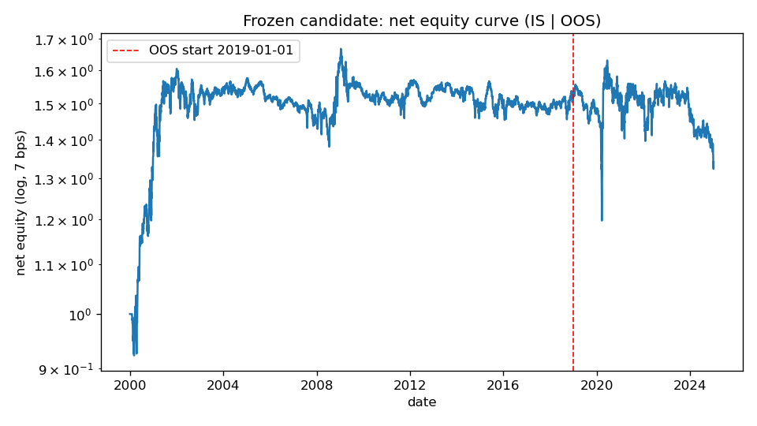

# Execution-Aware Short-Horizon Equity Reversal
### Evidence of decay, costs, and capacity limits (US equities, 2000–2024)


**Does short-horizon residual reversal in US equities still survive realistic execution?**
This repo answers that with a leak-safe CRSP backtest, building from a raw reversal baseline
up to a sector-residual, turnover-controlled strategy, then stress-testing it for costs,
capacity, and regime dependence — and validating it once on a sealed out-of-sample period.

**Headline finding:** the edge was real and strong in the early 2000s but **decayed steadily
and does not survive realistic costs out-of-sample (2019–2024)** — a crowded, cost-sensitive,
low-capacity anomaly that has largely been arbitraged away.

|                              | Gross Sharpe | Net Sharpe @7bps | Breakeven cost |
|------------------------------|:-----------:|:----------------:|:--------------:|
| In-sample (2000–2018)        | 0.90        | **+0.34**        | 11.3 bps       |
| **Out-of-sample (2019–2024)**| **0.23**    | **−0.15**        | **4.2 bps**    |

Deflated Sharpe of the in-sample result (accounting for the 12 configurations tried): **0.20**.



## Why this question
Short-horizon reversal (Lehmann 1990; Lo–MacKinlay 1990) is a textbook stat-arb effect. The
practitioner's question isn't "does it appear in a backtest" — it's whether it survives
**turnover, transaction costs, and capacity** once implemented honestly. This project answers
that with disciplined methodology rather than a curve fit; the goal is a credible research
process, and the negative-but-rigorous result is the point.

## The research arc
- **Leak-safe data layer** — survivorship-bias-free CRSP daily via WRDS; delisting returns
  imputed (Shumway −30% for missing performance delistings); point-in-time universe; and a
  strict split between the *realized-return* panel and the *tradability* mask, so a losing
  position can never silently vanish from PnL.
- **Signal ladder** — raw reversal → market-residual → **leave-one-out sector-residual**;
  each step lifts the per-trade edge (breakeven 4.4 → 5.1 → 5.5 bps).
- **Turnover control** — EWMA signal smoothing roughly halves turnover and flips the
  in-sample net Sharpe positive (breakeven 5.5 → 11.3 bps).
- **Execution layer** — a cost-sensitivity curve and a square-root market-impact capacity
  analysis (usable capacity ~$10–100M; a thin-name participation tail is the binding
  constraint, partly controlled by an ADV position cap).
- **Diagnostics** — subperiod decay; beta-adjusted legs (the alpha is **short-side**,
  concentrated in **low-price** names → a borrow caveat); regime conditioning (the strategy
  behaves like **short-momentum / liquidity provision** — earns in high-dispersion markets,
  loses when trends persist); broad PnL (top-10 names ≈ 8%).
- **One-shot OOS** — the frozen candidate evaluated exactly once on 2019–2024.

## Key figures
`reports/figures/oos_equity.png` (net equity, IS │ OOS) · `cost_sensitivity.png` ·
`capacity.png` · `participation_cap.png`. Full write-up: **`reports/Equity_StatArb_Memo.pdf`**.

## Reproduce
```bash
pip install -r requirements.txt
# 1) pull CRSP (needs a WRDS account; first call prompts for login)
python -c "from src.data.wrds_pull import pull_crsp_daily; pull_crsp_daily()"
# 2) build leak-safe panels
python -c "from src.data.load import build_panel, build_sector_panel; build_panel(); build_sector_panel()"
# 3) analyses (each writes a table and/or a figure)
python scripts/run_backtest.py       # raw vs market-residual vs sector-residual
python scripts/cost_sensitivity.py   # net Sharpe vs cost
python scripts/capacity.py           # net Sharpe vs AUM (market impact)
python scripts/robustness.py         # subperiod decay + beta-adjusted legs
python scripts/oos_evaluation.py     # the one-shot OOS
pytest -q                            # 28 tests (incl. look-ahead + leak guards)
```

## Repo map
```
config.yaml          single source of truth (universe, costs, params, OOS split)
research_log.md      full dated decision journal + experiment ledger
src/
  data/    wrds_pull (raw CRSP) · load (leak-safe panels, delisting, eligibility, sectors)
  signals/ reversal · residual (market + LOO sector)
  portfolio/ construct (locked candidate)
  backtest/ engine (look-ahead-safe) · metrics (Sharpe/IR/DD/turnover/deflated Sharpe)
  execution/ impact (square-root impact, participation, capacity)
scripts/   one script per analysis (see Reproduce)
tests/     metric, pipeline-leak, signal, and impact tests
reports/   memo + figures
```

## Honest limitations
Flat 7 bps cost headline (2–10 bps sensitivity reported); square-root impact coefficient is
uncertain (a range is shown); short borrow is not modeled (relevant since the alpha is
short-side); daily data, so this is *execution-aware*, not intraday/limit-order-book.

## References
Lehmann (1990) · Lo & MacKinlay (1990) · Avellaneda & Lee (2010) · Jegadeesh & Titman (1993) ·
Harvey, Liu & Zhu (2016) · Bailey & López de Prado (2014) · Almgren & Chriss (2000).
